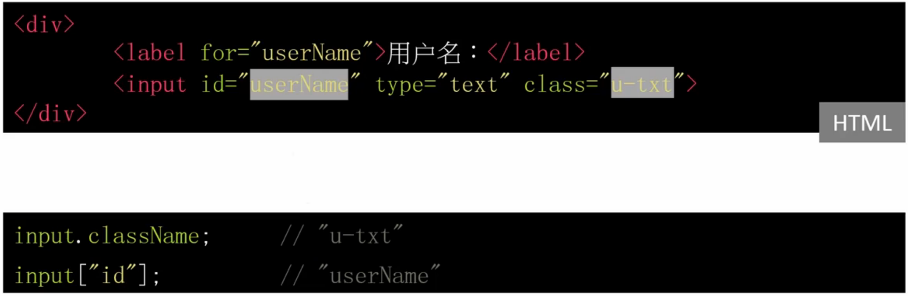
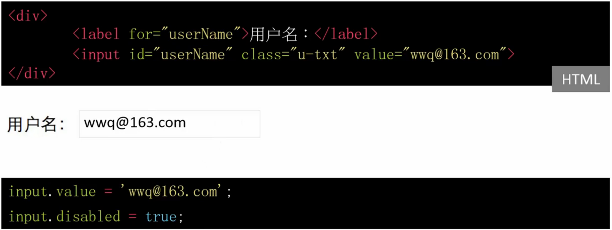
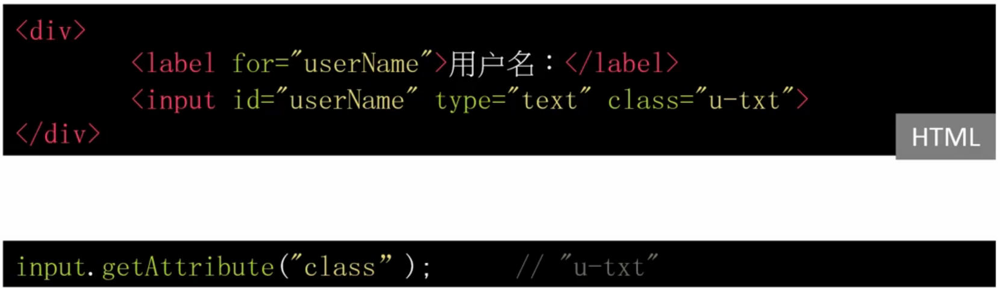
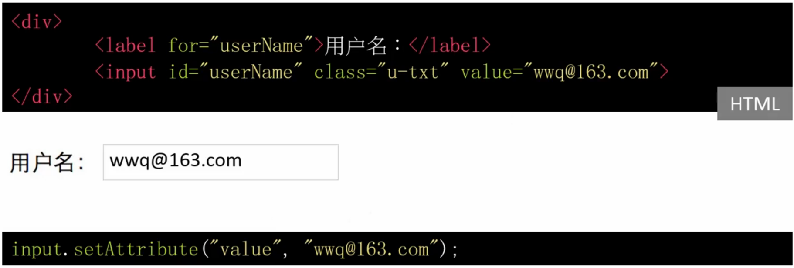
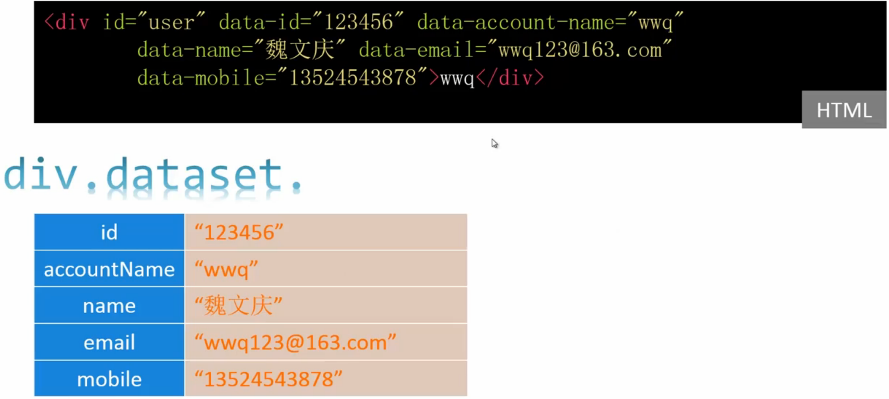

#属性操作
* property accessor
* getAttribute/setAttribute
* dataset

##property accessor

###读

###写

##getAttribute/setAttribute

###读
`var attribute = element.getAttribute(attributeName);`

###写
`element.setAttribute(name, value);`

##dataset
* HTMLElement.dataset
* data-*属性集
* 元素上保存数据

