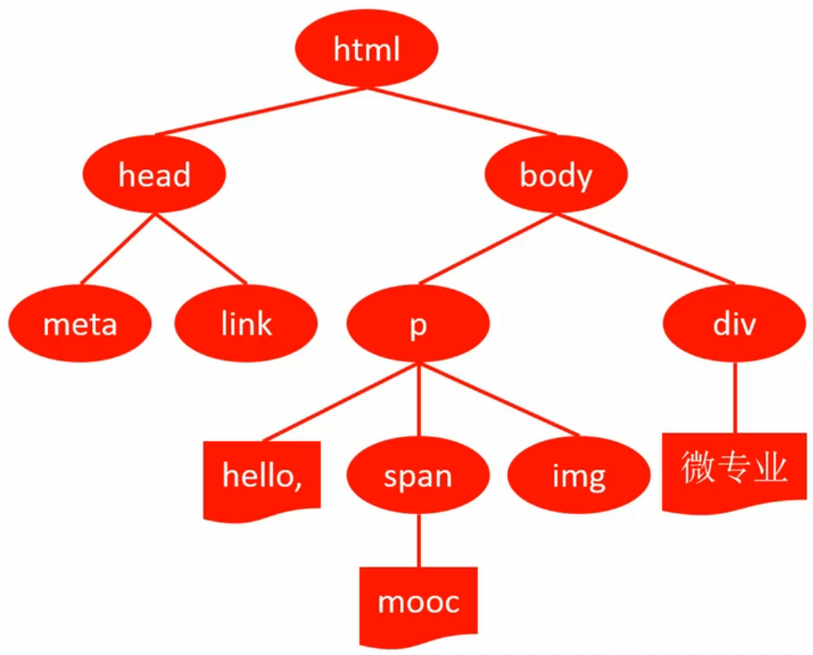

#DOM
文档对象模型
* DOM Core
* DOM HTML
* DOM Style
* DOM Event

##HTML -> DOM
```html
<html>
  <head>
    <meta charset="utf-8">
    <link href="style.css">
  </head>
  <body>
    <p>
      hello,<span>mooc</span>
      
    </p>
    <div>微专业</div>
  </body>
</html>
```


###节点类型
* ELEMENT_NODE
* TEXT_NODE
* COMMENT_NODE
* DOCUMENT_TYPE_NODE
