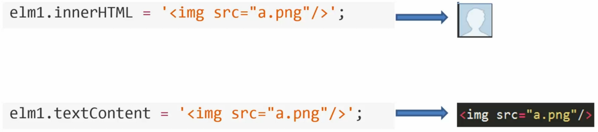

#节点操作
* 获取节点
* 创建节点
* 插入节点
* 修改节点
* 删除节点

##获取节点
* getElementById
* getElementsByClassName
* getElementsByTagName
* querySelector

###getElementById
`var elm = document.getElementById(IDString);`

参数名称 | 类型 | 是否必选 | 描述
:------ | :------ | :------ | :------
IDString | String | 是 | id字符串
elm | Node |   | 被标记id为IDString的节点
```javascript
function $(id){//简化操作
  return document.getElementById(id);
}
```

###getElementsByClassName
`var collection = [elm|document].getElementsByClass(classes)`

参数名称 | 类型 | 是否必选 | 描述
:------ | :------ | :------ | :------
classes | String | 是 | 一个或多个className(由空格分隔)
collection | HTMLCollection |   | live html collection

###getElementsByTagName
`var collection = [elm|document].getElementsByTagName(tag)`

参数名称 | 类型 | 是否必选 | 描述
:------ | :------ | :------ | :------
tag | String | 是 | 标签名或*
collection | HTMLCollection |   | live html collection

###querySelector
`var nodeList = [elm|document].querySelector[All](selector)`

参数名称 | 类型 | 是否必选 | 描述
:------ | :------ | :------ | :------
selector | String | 是 | CSS选择器
nodeList | HTMLCollection |   | not live collection
```javascript
function $(selector){
  return document.querySelectorAll(selector);
}
```

###live collection与not live collection的区别
live collection是可变的，当修改了页面上面的节点后相应的会发生改变  
not live collection不变

###兼容ie6
```javascript
function getElementsByClassName(elm, clazz){
  if(elm.getElementsByClassName){
    return elm.getElementsByClassName(clazz);
  }else{
    var list = elm.getElementsByTagName('*'), result = [];
    for(var i=0,l=list.length;i<l;i++){
      if((' ' + list[i].className + ' ').indexOf(' ' + clazz + ' ') != -1){
        result.push(list[i]);
      }
    }
    return result;
  }
}
```

##创建节点
* createElement
* innerHtml

###createElement
`var element = document.createElement(tag)`

参数名称 | 类型 | 是否必选 | 描述
:------ | :------ | :------ | :------
tag | String | 是 | 标签名
element | node |   |

###innerHTML
`element.innerHTML = HTMLString`

参数名称 | 类型 | 是否必选 | 描述
:------ | :------ | :------ | :------
HTMLString | String |  | 
element |  |  | 同步解析HTMLString为element dom数

###应用
* 节点个数
* 事件处理
* 结合使用

##插入节点
* appenfChild
* insertBefore
* insertAdjacentElement
* insertAdjacentHTML

###appenfChild
`var child = parament.appendChild(child)`

参数名称 | 类型 | 是否必选 | 描述
:------ | :------ | :------ | :------
child | node | 是 | 将节点插入到父节点最后子节点之后
parent | node |  | 父节点

###insertBefore
`var newElm = parent.insertBefore(newElm, rElm)`

参数名称 | 类型 | 是否必选 | 描述
:------ | :------ | :------ | :------
newElm | node | 是 | 将要插入的节点
rElm | node | 是 | newElm将要插入的之前节点
parent | node | 是 | 父节点

###insertAdjacentElement
`var oElm = elm.insertAdjacentElement(sWhere, oElm)`

参数名称 | 类型 | 是否必选 | 描述
:------ | :------ | :------ | :------
sWhere | String | 是 | 位置描述(beforeBegin,afterBegin,beforeEnd,afterEnd)
oElm | node | 是 | 插入的节点
elm | node | 是 | 参照节点

###insertAdjacentHTML
`var oElm = elm.insertAdjacentHTML(sWhere, HTMLString)`

参数名称 | 类型 | 是否必选 | 描述
:------ | :------ | :------ | :------
sWhere | String | 是 | 位置描述(beforeBegin,afterBegin,beforeEnd,afterEnd)
HTMLString | String | 是 | 
elm | node | 是 | 参照节点

##修改节点
* innerHTML
* textContent(innerText)

###textContent(innerText)
* Firefox兼容
```javascript
HTMLElement.prototype.__defineGetter__("innerText", function(){
  return this.textContent;
})
HTMLElement.prototype.__defineSetter__("innerText", function(s){
  this.textContent = s;
})
```

###innerHtml vs innerText


##删除节点
* removeChild
* replaceChild
* innerHTML

###removeChild
`var rchild = parent.removechild(child)`

参数名称 | 类型 | 是否必选 | 描述
:------ | :------ | :------ | :------
child | node | 是 | 需要删除的节点
parent | node | 是 | child的父节点
rchild | node |  | 被删除的节点
```javascript
function remove(elm){
  elm.parentNode.removeChild(elm);//可以不用先获取parent
}
```

###replaceChild
`var roElm = parent.replacechild(newChild, oElm)`

参数名称 | 类型 | 是否必选 | 描述
:------ | :------ | :------ | :------
newChild | node | 是 | 需要插入的节点
oElm | node |  | 需要删除的节点
parent | node | 是 | oElm的父节点
roElm | node |  | 被删除的节点

###应用
* replaceChild == removeChild & appendChild
* 注意点
 * remove event
 * elm.innerHTML = ''
