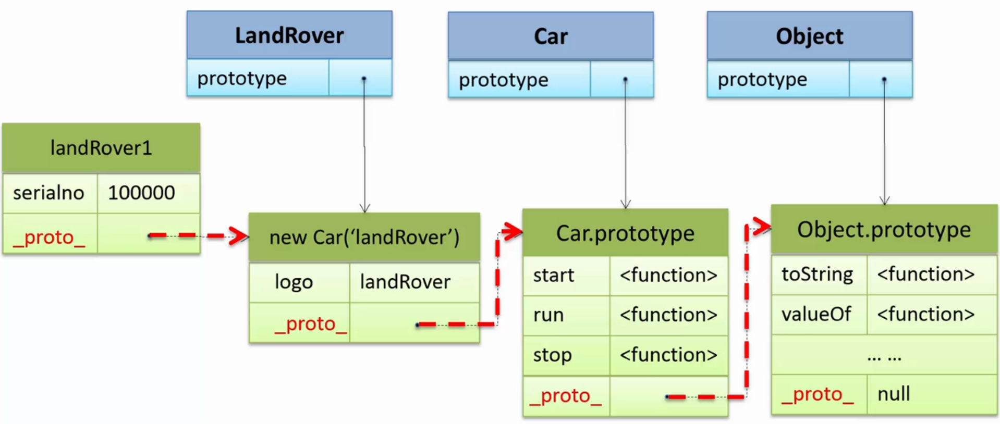

#原型VS类
* 类  

* 原型  


#设置对象的原型
* Object.create(proto[, propertiesObject])
 * proto 一个对象，作为新创建对象的原型
 * propertiesObject 对象的属性定义  
  

* 构造函数
 * 使用prototype设置原型
 * 使用new创建对象  


 
#原型链
```javascript
//Car构造函数
function car(logo) {
  this.logo = logo || 'nuknown name'
}
//设置Car的prototype属性
Car.prototype = {
  start: function() {
    comsole.log('%s start', this.logo);
  }
  run: function() {
    comsole.log('%s running', this.logo);
  }
  stop: function() {
    comsole.log('%s stop', this.logo);
  }
}

//LandRover构造函数
function LandRover(serialno) {
  this.serialno = serialno;
}
//设置LandRover的prototype属性
LandRover.prototype = new Car('landRover');
var landRover1 = new LandRover(100000);
var landRover2 = new LandRover(100001);

console.log(landRover1.serialno);
console.log(landRover1.logo)
```
  
当访问对象属性时，会先从自身的属性按照原型链的顺序往下访问，直到找到这个属性。  
当修改或删除对象属性时，只会修改或者删除对象自生的属性，不会对原型产生影响。
##hasOwnProperty
用于判断某个属性是否是这个对象的自身的属性，如果是返回true，不是则返回false。  
原型链上的属性虽然可以被访问到但是不属于对象自身的属性。
```javascript
landRover1.hasOwnProperty('serialno');//true
landRover1.hasOwnProperty('logo');//false
```
