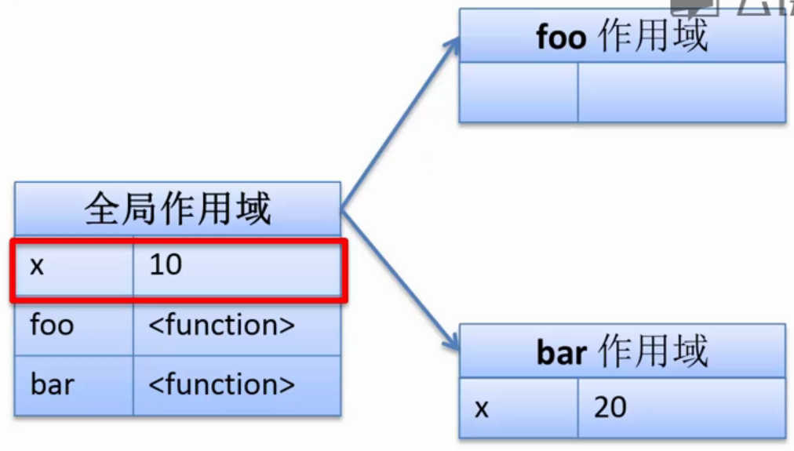
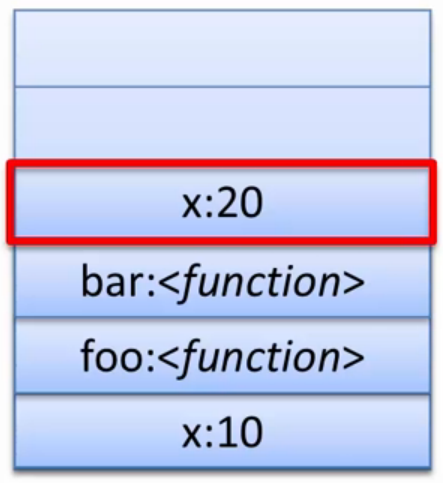
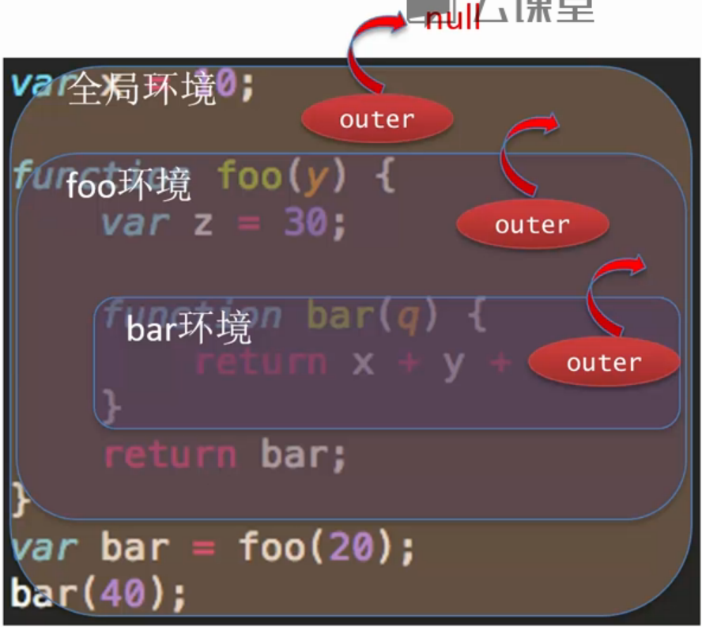
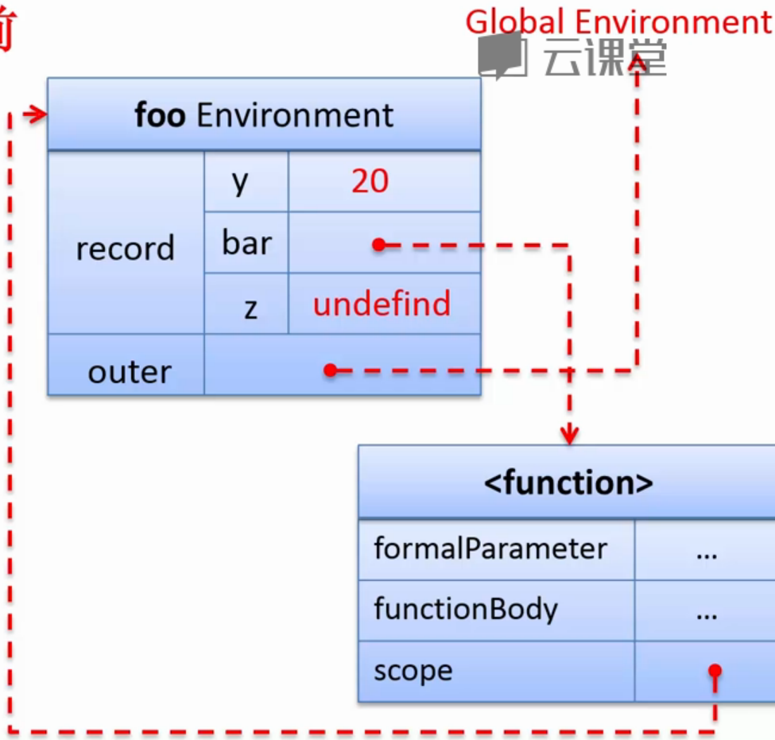
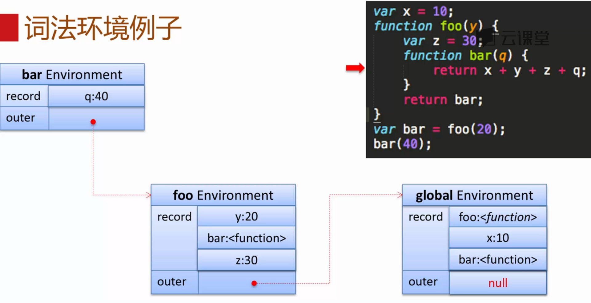
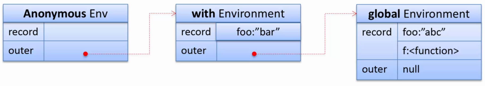
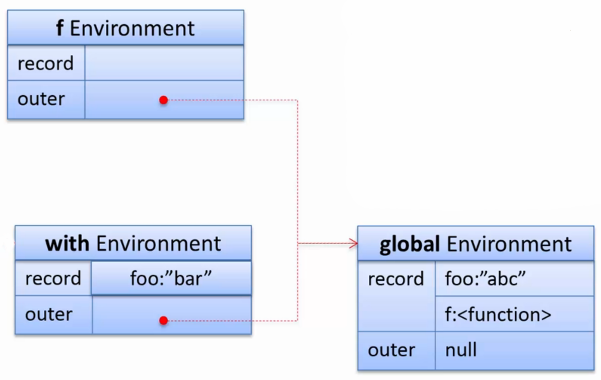
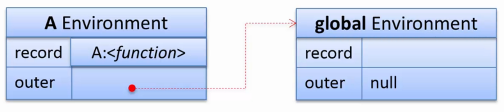

#变量作用域
变量作用域主要包含变量的
* 声明周期
* 作用范围

##静态作用域
* 又称为词法作用域
* 由程序定义的位置决定

```javascript
var x = 10;
function foo(){
  alert(x);
}
function bar(){
  var x = 20;
  foo();//执行时会找到全局作用域中的x = 10
}
bar();
```


##动态作用域
* 程序运行时刻决定
```javascript
var x = 10;
function foo(){
  alert(x);
}
function bar(){
  var x = 20;
  foo();
}
bar();
```
找离栈顶最近的相符的变量名  


#JS变量作用域
* JS使用静态作用域
* JS没有块级作用域
* ES5中使用词法环境管理静态作用域

##词法环境
* 环境记录
 * 形参
 * 函数声明
 * 变量
 * ...
* 对外部词法环境的引用(outer)



###环境记录初始化 - *声明提前*
```javascript
var x = 10;

function foo(y){
  var z = 30;
  
  function bar(q){
    return x + y + z + q;
  }
  return bar;
}
var bar = foo(20);//foo执行前初始化
bar(40);
```
函数准备执行前进行初始化   




###词法环境 - with
```javascript
var foo = "abc";
with({
  foo: "bar"
}){
  function f(){
    alert(foo);//这个函数的outer为全局环境，所以这个foo为"abc"
  };
  (function(){
    alert(foo);//这个匿名函数的outer为with环境，所以这个foo为"bar"
  })();
  f();
}
```
with创建一个临时环境，会把with中的对象的属性记录到环境记录中。  
函数定义的词法环境是不变的，根据函数的定义得出。  
函数表达式的词法环境可能被改变，比如在with语句中。  
  


###词法环境 - try...catch
```javascript
try{
  var e = 10;
  throw new Error();
}catch(e){
  function f(){
    alert(e);//全局环境中的e
  }
  (function(){
    alert(e);//catch到的e
  })();
  f()
}
```
类似于with环境。  
catch只把产生的异常e记录到环境记录中。

##带名称的函数表达式
```javascript
(function A(){
  A = 1;
  alert(A);//这个A为函数A
})();
```

