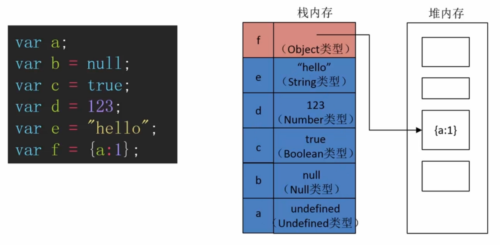

  

#原始类型和对象类型的区别
所有的原始类型直接存储在栈内存中，对象类型在栈内存中保存了对象实体所在的内存地址。  
  
原始类型变量赋值给另一个变量时在栈内存中复制一份原值，在对新变量的值进行改变时原来变量的值不变。  
对象类型变量赋值给另一个变量时在栈内存中复制了一份内存地址指向的是同一个对象的实体，他们修改对象时修改的是同一个对象。

#隐式类型转换
除了`+`之外所有的数值运算符在做有数值类型和字符串类型的运算时会把字符串隐式转换为数值类型，`+`会把所有的数值类型隐式转换为字符串类型做字符串拼接。  
所有的直接量使用`.`调用函数时会先将直接量隐式转换为相对应的对象类型去调用对象类型的方法。  
if语句中的条件结果都会被隐式转换为Boolean值。
##隐式类型转换结果  


#显式类型转换
* Number() 将参数中的值转换为数字,String() 将参数中的值转换为字符串,Boolean() 将参数中的值转换为Boolean值
* parseInt(),parseFloat()
* !,!! 将当前值转换为对应的boolean值

#类型识别
* typeof  

* instanceof  

* Object.prototype.toString.call  
  

* construtor  
  
```Javascript
/*
* 获取对象构造函数名称
*/
function getConstructorName(obj){
    return obj && obj.constructor && obj.constructor.toString().match(/function\s*([^(]*)/)[1];
}
```
