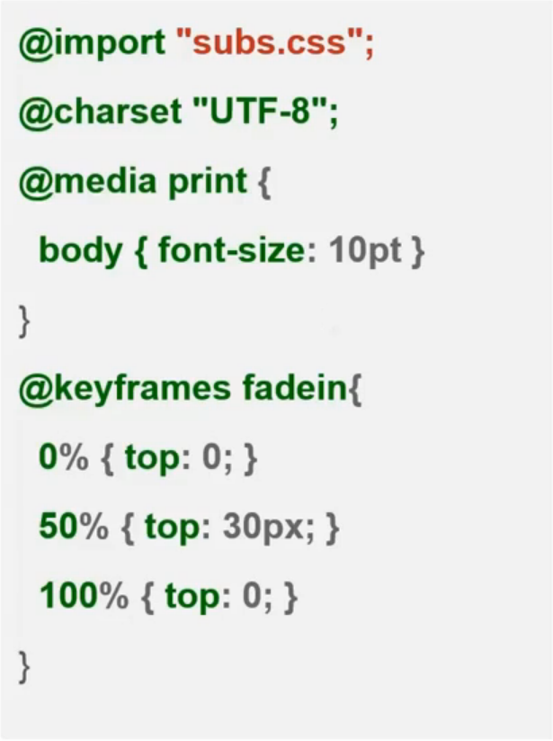

#CSS
* Cascading Style Sheet
* 定义页面的样式

#引入
* 外部样式表
```html
<head>
    <link rel="stylesheet" href="base.css">
</head>
```
* 内部样式表
```html
<head>
    <style>
      body{background-color: red;}
      p{margin-left: 20px;}
    </style>
</head>
```
* 内嵌样式
```html
<p style="color: red;margin-left: 20px;">
    this is a paragraph
</p>
```

#语法
```CSS
selector{
    property1:value;
    property2:value;
    ......
}
```
* selector 选择器
* property1:value; 属性声明
 * 属性声明最后一个可以不用加分号（不推荐）
 * 键值对形式
 * 属性名:属性值;
* 注释 `/* 注释内容 */`

#浏览器私有属性
* chrome,safari
 * -webkit-
* firefox
 * -moz-
* IE
 * -ms-
* opera
 * -o-

#属性值语法
* margin:\[\<length\>|\<percentage\>|auto\]\{1,4\}

##基本元素
* 关键字
 * auto,solid,bold...
* 类型
 * 基本类型（\<length\>,\<percentage\>,\<color\>,...）
 * 其他类型（\<'padding-width'\>,\<color-stop\>,...）
* 符号（/ ,）
* inherit,initial

##组合符号
* 空格
 * 两个类型必须出现而且顺序一致
 * `<'font-size'> <'font-family'>`
    * 合法值  
    `12px arial`
    * 不合法值  
    `2em`  
    `arial 14px`
* &&
 * 两个类型必须出现顺序不一定
 * `<length>&&<color>`
    * 合法值  
    `green 2px`  
    `1em blue`
    * 不合法值  
    `blue`
* ||
 * 至少出现一个，顺序不定
 * `underline||overline||line-through||blink`
    * 合法值  
    `underline`  
    `overline underline`
* |
 * 只出现一个
 * `<color>|transparent`
    * 合法值  
    `orange`
    `transparent`
    * 不合法值  
    `blue transparent`
* \[\]
 * 将类型进行分组,大括号里面看作一个整体
 * `bold [thin||<length>]`
    * 合法值  
    `blod thin`  
    `bold 2em`

##数量符号
* 无
 * 只出现一次
 * `<length>`
    * 合法值  
    `1px`  
    `10em`
    * 不合法值  
    `1px 2px`
* \+
 * 出现一次或者多次
 * `<color-stop>[,<solor-stop>]+`
    * 合法值  
    `#fff,red`  
    `blue,green 50%,gray`
    * 不合法值  
    `red`
* ?
 * 出现零次或一次
 * `inset?&&<color>`
    * 合法值  
    `inset bile`
    `red`
* \{\}
 * 里面的数值左边表示最少出现的次数，右边表示最多出现次数
 * `<length>{2,4}`
    * 合法值  
    `1px 2px`  
    `1px 2px 3px`
    * 不合法值  
    `1px`
* \*
 * 可以出现零次或者多次
 * `<time>[,<time>]*`
    * 合法值  
    `1s`  
    `1s,4ms`
* \#
 * 出现一次或者多次，中间用逗号隔开，类似 `<time>[,<time>]*`
 * `<time>#`
    * 合法值  
    `2s,4s`
    * 不合法值  
    `1ms 2ms`

##@规则语法

  

* `@ 标识符 内容`
* `@ 标识符 内容{}`

###常用@规则
* @media 用于响应式布局
* @keyframes 用于动画关键帧
* @font-face 引入外部字体
