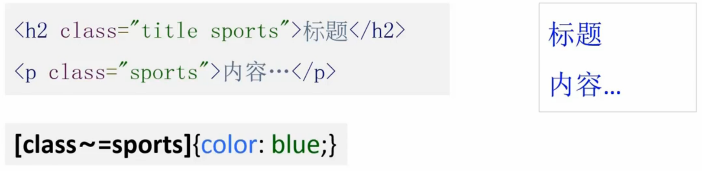

#选择器
* 简单选择器
* 伪元素选择器
* 组合选择器

##简单选择器
### 标签选择器  
选中这个类型的标签  
`p{color:blue;}` 表示选中所有p标签并赋予大括号中的样式

###类选择器  
选中有指定的class属性的值的标签  
`.special{color:red;}` 表示选中所有class属性值为special的标签
* `.className` 以`.`开头
* className可以为字母，数字，-，_
* className必须以字母开头
* className区分大小写
* **相同className可以在同一页面出现多次**
 

###id选择器  
选中具有指定id属性的值的标签  
`#banner{color:black;}` 表示选中id属性值为banner的标签
 * `#id` 以`#`开头
 * id可以为字母，数字，-，_
 * id必须以字母开头
 * id区分大小写
 * **相同id同一页面只出现一次**
 

###通配符选择器  
选中所有标签

###属性选择器  
选中具有某个属性的标签  
`[disabled]{background-color:#eee;}` 表示选中具有disabled这个属性的标签  
  
选中某个属性是某个值的标签  
`[type=button]{color:blue}` 表示选中type属性的值为button的标签，特例：id选择器 #xxx=[id=xxx]  
  
选中某个属性包含某个值的标签  
`[class~=sports]{color:blue}` 表示选中class属性的值中包含sports这个值的标签，特例：类选择器 .xxx=[class~=xxx]  
  
选中某个属性是某个值或者以这个值加`-`开头的标签  
  
选中某个属性的值为某些字符开头的标签  
  
选中某个属性的值为某些字符结尾的标签  
  
选中某个属性的值包含某些字符的标签  

###伪类选择器
**都是以`:`开头**  
  
`:link`和`:visited`只用于链接元素，`:hover`和`:active`可用于其他元素，假如四个都要应用必须按照图片上的顺序。
* `:enabled` 可用
 * `input:enbled{}`
* `:disabled` 不可用
 * `input:disabled{}`
* `:checked` 选中
 * `input:checked`

* `:first-child` 第一项  

* `:last-child` 最后一项  

* `:nth-child()` 选择第n项，2n表示偶数项，n从0开始  

* `:nth-last-child()` 倒数选择第n项
* `:only-child` 选中只有一个子元素的项  

* `:first-of-type` 选中第一个这个类型的元素  

* `:last-of-type` 选中最后一个这个类型的元素
* `:nth-of-type()` 选中第n个这个类型的元素
* `:nth-last-of-type` 倒数选中第n个这个类型的元素
* `:only-of-type` 选中这个元素的父元素只有唯一的这一个类型的元素  

* `:empty` 选中没有内容的元素
* `:root` 选中根标签
* `:not()` 选中不包含某个选择器选中的标签
* `:target` 选中锚点目标元素
* `:lang()`
